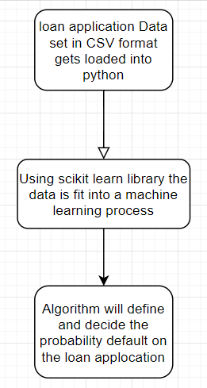

# Modeling-probability-of-default

DATASET SOURCE: https://www.fanniemae.com/portal/funding-the-market/data/loan-performance-data.html

### ✓ Selected topic : 

Modeling-probability-of-default

### ✓ Reason why they selected their topic : 

There is a risk in housing market where the applicant of a mortgage application could default on their mortgage payments or the whole loan altogether. Team 7 is going to look into past data of USA mortgage market to see if a common lifestyle or pattern exists to those files which ended up being put in default or bankcrupt status.

### ✓ Description of their source of data 

https://www.fanniemae.com/portal/funding-the-market/data/loan-performance-data.html

Fannie Mae provides loan performance data on a portion of its single-family mortgage loans to promote better understanding of the credit performance of Fannie Mae mortgage loans.

### ✓ Questions they hope to answer with the data

How often do mortgages go into default status?

Is income to loan ratio a major factor to determine risk factor?

Are some states better in maintaining and finishing their term than others?

### Group Name: 

Team 7

### Group Members: 

Azaima Azghar: Square Role; Repository Manager

Colin Wallace : Triangle role; Machine Learning Architect

Kalkidan Alemayehu: Circle role; Database Manager

Osama Ali: X role ; Technology Manager

#### Which tools are the best fit for your project? 

PGadmin/PostGress, Google Colabs/Jupyter Notebook, Amazon AWS, Github, Microsoft Excel, Flask

#### What will be used for each section? 

Postgress: Database Management, Organizing tables, removing columns which dont provide value

Google Co-Labs/ Jupyter Notebook: Data cleaning and Machine Learning algorith execution will be set up using Python, pandas and Scikit Learn libraries

Amazon AWS: Database, CSV and other data file storage

Github: Creating and maintaining Git repository for submission and project colaboration

Microsoft Excel: Evaluating our dataset on a high level.

#### How will the dashboard be built?

Dashboard will probably be built using python plotly and dash.
